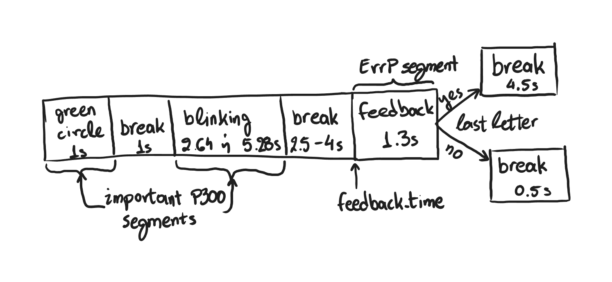

**_Σημείωση 1_**: Για την διάσπαση των σημάτων EEG σε κομμάτια έχουν ληφθεί υπόψη όλοι οι χρόνοι που αναφέρονται στο <a href="https://onlinelibrary.wiley.com/doi/10.1155/2012/578295">paper</a> του διαγωνισμού.

**_Σημείωση 2_**: Μέχρι στιγμής ο αλγόριθμος δεν εντοπίζει κανένα P300 πριν το πρώτο feedback καθώς από την αρχή του πειράματος μέχρι να φανεί η πρώτη λέξη υπάρχει μια περίοδος calibration. Αργότερα θα μπορούμε να τα εντοπίσουμε καθώς θα μας χρειαστούν.

**_Σημείωση 3_**: Το παρόν έγγραφο θα ανανεώνεται κάθε φορά που θα προστίθεται ή θα αλλάζει κάτι στον κώδικα του `detection.py`.

# Προ-επεξεργασία του σήματος EEG
Το κάθε EEG φιλτράρεται με ζωνοπερατό φίλτρο αρχικά μεταξύ των συχνοτήτων 0.1Hz και 30Hz ώστε να αφαιρεθεί ο θόρυβος, όπως βρέθηκε στην βιβλιογραφία. Στην συνέχεια, φιλτράρεται άλλη μια φορά με του ίδιου τύπου φίλτρο, αυτή την φορά μεταξύ των συχνοτήτων 0.2Hz και 10Hz, καθώς σε αυτές τις συχνότητες βρέθηκε να έχει συγκεντρωμένη σχεδόν όλη του την ενέργεια το τμήμα ErrP μέσω φασματικής ανάλυσης που πραγατοποιήθηκε στο αρχείο `spectral_analysis.ipynb`. Η υλοποίηση του φίλτρου γίνεται στην συνάρτηση `bandpass_filter_all(lowcut, highcut, fs, order)` στο αρχείο `utils.py`.

# Αλγόριθμος εντοπισμού P300 δυναμικών

Στο παραπάνω σκίτσο φαίνεται ο διαχωρισμός του σήματος EEG σε επιμέρους κομμάτια. Για τον εντοπισμό των P300 είναι αναγκαία η απομόνωση των κομματιών που αναφέρονται ως σημαντικά P300 τμήματα καθώς σε αυτά είναι πιο πιθανό να βρεθούν τα δυναμικά που ψάχνουμε.

Το σύνολο δεδομένων του διαγωνισμού μας δίνει για κάθε σήμα μια λίστα με τις στιγμές που εμφανίζεται το feedback στην οθόνη του χρήστη κατά την διάρκεια του πειράματος. Επομένως, χρησιμοποιούμε αυτές τις χρονικές στιγμές ως σημεία αναφοράς για να διαχωρίσουμε το σήμα γύρω από αυτές στα κομμάτια που φαίνεται παραπάνω.

Όλη η επεξεργασία του σήματος, ο διαχωρισμός του σε τμήματα και η απόφαση για το αν κάποιο τμήμα περιέχει δυναμικό P300 γίνεται μέσα στην κλάση `FileProcessor`. Οι μέθοδοι της είναι οι εξής(όταν μια συνάρτηση παίρνει ως όρισμα `feedback_id` εκτελεί την λειτουργία της για το κομμάτι του σήματος μετά το feedback με αριθμό μετά από αυτό το id. Αντίστοιχα, η παράμετρος `channel` σημαίνει πως εκτελεί την λειτουργία της στο ορισμένο κανάλι του σήματος μόνο. Τέλος, η παράμετρος `verbose` αν οριστεί σε True τότε κατά την εκτέλεση της μεθόδου θα τυπώνονται debugging messages):
- `is_last_letter(feedback_id)`: επιστρέφει `True` αν μετά το feedback με αριθμό feedback_id τελειώνει μια λέξη, αλλιώς `False`
- `get_break_after_feedback(feedback_id, channel)`: επιστρέφει την διάρκεια του break μετά το feedback δηλαδή `4.5` ή `0.5` καθώς και την μέση τιμή του break κομματιού
- `get_erp_segment(feedback_id, channel)`: επιστρέφει όλο το κομμάτι του σήματος από το green circle έως και την αρχή του επόμενου feedback
- `get_blinking_time(feedback_id, channel)`: επιστρέφει την περίοδο του κομματιού που έχω ονομάσει ως blinking στο σχήμα. Την βρίσκει μετρώντας την διάρκεια όλου του erp segment, αφαιρώντας τα υπόλοιπα κομμάτια και βρίσκοντας την απόσταση από τον πιο κοντινό επιτρεπτό χρόνο
- `get_important_parts(feedback_id, channel, extra_offset)`: επιστρέφει ένα dictionary τύπου: `{ feedback_id: ..., channel: ..., green_raw: ..., green_processed: ..., blinking_raw: ..., blinking_processed: ... }`. Τα πεδία περιέχουν τα αντίστοιχα κομμάτια του σήματος. Τα `_processed` πεδία περιέχουν τα κομμάτια του σήματος αφού πρώτα τους έχει αφαιρεθεί ο μέσος όρος των κομματιών break που προηγούνται από το καθένα
- `sliding_window(feedback, channel)`: επιστρέφει 4 χαρακτηριστικά για το κάθε κομμάτι blinking σήματος που κόβει με την τεχνική του κυλιόμενου παραθύρου μήκους 0.5s και βήματος 0.25fs samples. Τέλος προσθέτει και ένα παράθυρο για όλο το green circle κομμάτι του σήματος. Τα χαρακτηριστικά που εξάγει για το κάθε κομμάτι(window) είναι: `mean`, `peak`, `latency` και `amplitude`
- `extract_features(feedback_id, verbose)`: επιστρέφει έναν πίνακα με τα χαρακτηριστικά όλων των windows για όλα τα κανάλια
- `extract_features_all(verbose)`: επιστρέφει έναν πίνακα με τα χαρακτηριστικά όλων των windows για όλα τα κανάλια και όλα τα feedback_ids

Στην συνέχεια η κλάση `SubjectData` χρησιμοποιείται για να συλλέξει όλα τα χαρακτηριστικά των εν δυνάμει P300 τμημάτων από όλα τα πειράματα για το κάθε subject και να τα κατηγοριοποιήσει σε P300 και non-P300. Η κατηγοριοποίηση αυτή γίνεται με την συνάρτηση `dbscan_features(pca_components, eps, top_percentage, verbose)`. Αρχικά, ο πίνακας με όλα τα δεδομένα που έχει `shape: (n_samples, n_features)` περνάει μέσα από έναν `StandardScaler` για να κανονικοποιηθούν τα χαρακτηριστικά του. Στην συνέχεια, χρησιμοποιείται η μέθοδος `PCA` για να ελλατωθεί η διάσταση του κάθε σημείου από 64 (16 channels x 4 features per channel) σε διάσταση `pca_components`. Ο πίνακας με τα λιγότερα χαρακτηριστικά ανά σημείο περνάει από την μέθοδο μη επιβλεπόμενης μάθησης `DBSCAN` για ομαδοποίηση με παραμέτρους `eps` και `min_samples = 5`. Η μέθοδος αυτή σπάει τα σημεία σε outliers(cluster label -1) και αρκετές άλλες ομάδες. Προκειμένου να λάβουμε ένα διάνυσμα με labels της μορφής 1: P300 και 0: non-P300, ταξινομούμε τις ομάδες σύμφωνα με τον μέσο όρο του χαρακτηριστικού `amplitude` και ορίζουμε πώς το `top_percentage` των πρώτων στην κατάταξη ομάδων θεωρείται P300 και οι υπόλοιπες non-P300. Τέλος, η συνάρτηση επιστρέφει τα `binary_labels` που είναι τα P300 labels για τα σημεία που επεξεργάστηκαν, τα `labels` που είναι όπως βγήκαν από τον αλγόριθμο ομαδοποίησης και τα `features_pca` που είναι τα χαρακτηριστικά που προέκυψαν από την μέθοδο `PCA`.

Για να λάβουμε μόνο τα σημεία που ομαδοποιήθηκαν ως P300, αρκεί να χρησιμοποιήσουμε τον τρόπο που αναγράφεται στο αρχείο `detection_test.ipynb`.

# Αλγόριθμος εντοπισμού ErrP δυναμικών
Για τον εντοπισμό των ErrP που προκύπτουν μετά το οπτικό ερέθισμα του feedback χρησιμοποιείται ο αλγόριθμος της μεθόδου `find_errp(feedback_id, channel, n, threshold, before, after, lat_fix, verbose)` που έχει υλοποιηθεί στην κλάση `FileProcessor`. Συγκεκριμένα, ο αλγόριθμος ξεκινά παίρνοντας το κομμάτι του παραπάνω σχήματος με όνομα "feedback". Ανιχνεύει τις κορυφές(peaks) του σήματος και κρατάει την μέγιστη από αυτές. Στην συνέχεια υπολογίζει τον αριθμό των κορυφών που ο λόγος τους προς την μέγιστη κορυφή ξεπερνά το `threshold`. Αν ο αριθμός αυτός είναι μικρότερος από `n` τότε αποφασίζει ότι το συγκεκριμένο κομμάτι περιέχει μέσα του ένα ErrP και επιστρέφει True αλλιώς False. Παράλληλα βρίσκει το `latency` δηλαδή ποια χρονική στιγμή εμφανίζεται η μέγιστη κορυφή και επιστρέφει ένα κομμάτι του σήματος αρχίζοντας `before` δευτερόλεπτα πριν το `latency` και τελειώντας `after` δευτερόλεπτα αργότερα. Έτσι, επιστρέφει τόσο αυτό το κομμάτι όσο και το `latency`. Τέλος, η μέθοδος `find_errp_all(n, threshold, before, after, lat_fix, verbose)` εκτελεί την παραπάνω μέθοδο για όλα τα feedbacks και channels και επιστρέφει τα αντίστοιχα με παραπάνω 4 χαρακτηριστικά για κάθε κομμάτι που περιέχει ένα ErrP.

## Τεχνικές λεπτομέρειες
- Η κλάση `SubjectData` με την ιδιωτική μέθοδο `__load_data()` υλοποιεί έναν μηχανισμό τύπου cache ώστε να μην χρειάζεται κάθε φορά που δημιουργείται ένα τέτοιο αντικείμενο να διαβάζει όλα τα αρχεία από το σύνολο δεδομένων, παρά μόνο την πρώτη φορά
